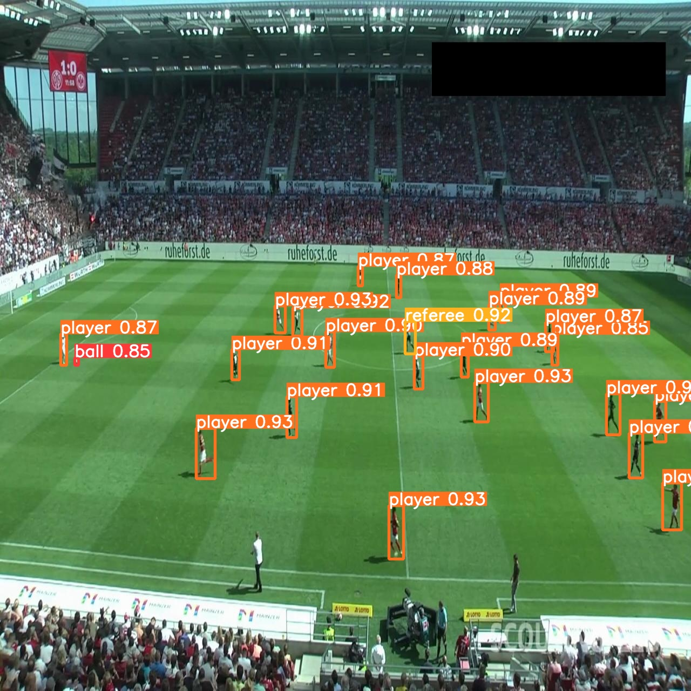

<div align="center">
  <p>
    <a align="center" href="https://ultralytics.com/yolov8" target="_blank">
      </a>
  </p>

<br>

<div>
    <a href="https://github.com/ultralytics/ultralytics/actions/workflows/ci.yaml"></a>
    <a href="https://zenodo.org/badge/latestdoi/264818686"></a>
    <a href="https://hub.docker.com/r/ultralytics/ultralytics"></a>
    <br>
    <a href="https://console.paperspace.com/github/ultralytics/ultralytics"></a>
    <a href="https://colab.research.google.com/github/ultralytics/ultralytics/blob/main/examples/tutorial.ipynb"></a>
    <a href="https://www.kaggle.com/ultralytics/yolov8"></a>
  </div>
<br>

[Ultralytics YOLOv8](https://github.com/ultralytics/ultralytics), developed by [Ultralytics](https://ultralytics.com),
is a cutting-edge, state-of-the-art (SOTA) model that builds upon the success of previous YOLO versions and introduces
new features and improvements to further boost performance and flexibility. YOLOv8 is designed to be fast, accurate, and
easy to use, making it an excellent choice for a wide range of object detection, image segmentation and image
classification tasks.

</a>
</div>

## Installation

``` shell
# clone repo
git clone https://github.com/akanametov/ultralytics

# pip install required packages
pip install ultralytics

# go to code folder
cd ultralytics
```

</details>

## Inference

On image:

```shell
yolo task=detect \
mode=predict \
model=yolov8m-football.pt \
conf=0.25 \
source=examples/football.jpg
```

<div align="center">
    <a href="./">
        
    </a>
</div>

## Results

PR curve:
<div align="center">
    <a href="./">
        
    </a>
    <a href="./">
        
    </a>
    <a href="./">
        
    </a>
</div>

Losses and mAP:
<div align="center">
    <a href="./">
        
    </a>
</div>

Confusion matrix:
<div align="center">
    <a href="./">
        
    </a>
</div>

## Training

Data preparation

* Download [dataset](https://universe.roboflow.com/roboflow-jvuqo/football-players-detection-3zvbc/dataset/2#):

``` shell
bash scripts/get_dataset.sh
```
and pretrained [yolov8m.pt](https://github.com/ultralytics/assets/releases/download/v0.0.0/yolov8m.pt) model.

Single GPU training

``` shell
# train model
yolo task=detect \
mode=train \
model=yolov8m.pt \
data=datasets/data.yaml \
epochs=100 \
imgsz=640
```

## Transfer learning

[`yolov8m.pt`](https://github.com/ultralytics/assets/releases/download/v0.0.0/yolov8m.pt)

## <div align="center">License</div>

YOLOv8 is available under two different licenses:

- **GPL-3.0 License**: See [LICENSE](https://github.com/ultralytics/ultralytics/blob/main/LICENSE) file for details.
- **Enterprise License**: Provides greater flexibility for commercial product development without the open-source
  requirements of GPL-3.0. Typical use cases are embedding Ultralytics software and AI models in commercial products and
  applications. Request an Enterprise License at [Ultralytics Licensing](https://ultralytics.com/license).

## <div align="center">Contact</div>

For YOLOv8 bugs and feature requests please visit [GitHub Issues](https://github.com/ultralytics/ultralytics/issues).
For professional support please [Contact Us](https://ultralytics.com/contact).

<br>
<div align="center">
  <a href="https://github.com/ultralytics" style="text-decoration:none;">
    </a>
  
  <a href="https://www.linkedin.com/company/ultralytics" style="text-decoration:none;">
    </a>
  
  <a href="https://twitter.com/ultralytics" style="text-decoration:none;">
    </a>
  
  <a href="https://www.producthunt.com/@glenn_jocher" style="text-decoration:none;">
    </a>
  
  <a href="https://youtube.com/ultralytics" style="text-decoration:none;">
    </a>
  
  <a href="https://www.facebook.com/ultralytics" style="text-decoration:none;">
    </a>
  
  <a href="https://www.instagram.com/ultralytics/" style="text-decoration:none;">
    </a>
</div>
